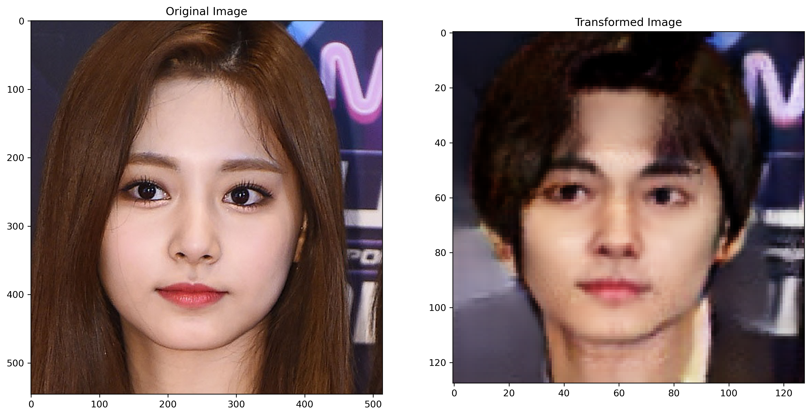
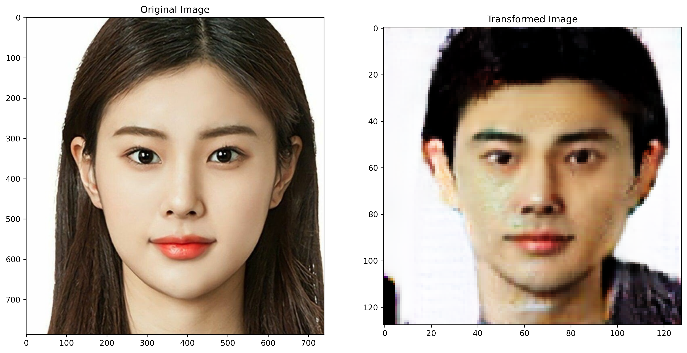
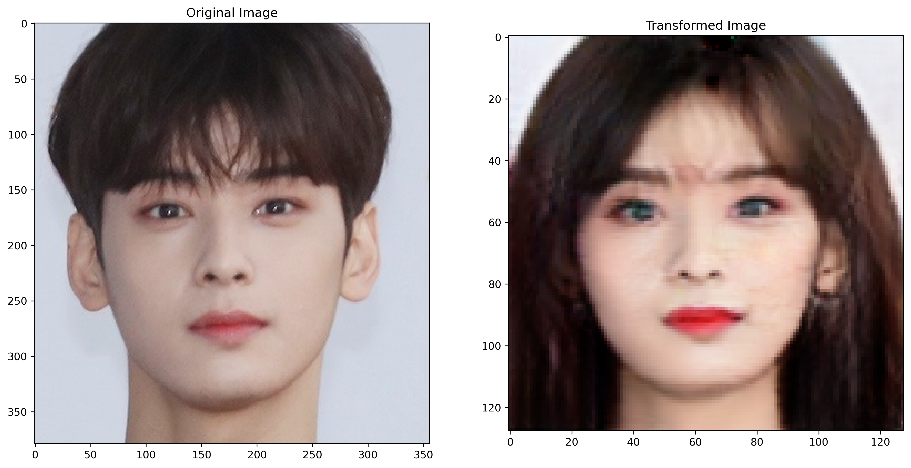
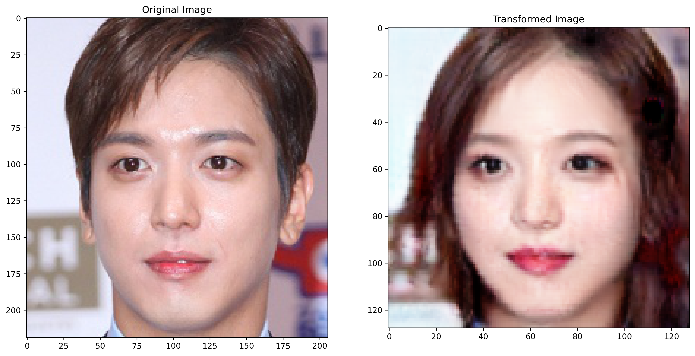

# CycleGAN-GenderShift

This project implements a CycleGAN model in PyTorch to transform facial images from one gender to another. The model is trained to learn the mapping between male and female faces using unpaired image data.The current implementation provides basic results, but additional training is necessary to improve the quality and accuracy of the transformations.
## ScreenShots

Here are some of the results of my model on test-dataset:

